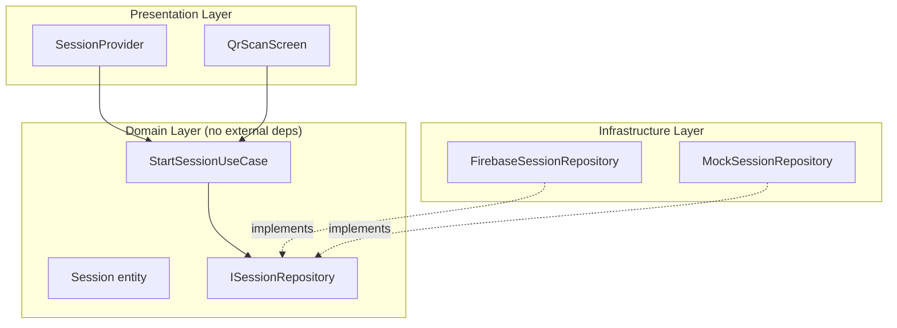

# /ddd-visualize — DDD Layer Visualization

Based on Lum1104/Understand-Anything `/understand-domain` pattern.
Analyzes `solidosis_ge/lib/domain/` and generates a Mermaid layer diagram.

## Steps

### 1. If Understand-Anything is installed
```powershell
# Windows install (one-time):
# iwr -useb https://raw.githubusercontent.com/Lum1104/Understand-Anything/main/install.ps1 | iex
# Then:
# /understand-domain
```

### 2. Manual DDD analysis (always available)

**Domain entities:**
```bash
grep -r "class.*Entity\|abstract class\|@freezed" solidosis_ge/lib/domain/ --include="*.dart" -l
```

**Use cases:**
```bash
grep -r "class.*UseCase\|Future.*call\b" solidosis_ge/lib/domain/ --include="*.dart" -l
```

**Repository interfaces:**
```bash
grep -r "abstract.*Repository\|interface.*Repository" solidosis_ge/lib/domain/ --include="*.dart"
```

**Dependency violations (domain→infrastructure):**
```bash
grep -r "import.*infrastructure\|import.*firebase\|import.*hive" solidosis_ge/lib/domain/ --include="*.dart"
```

### 3. Generate Mermaid diagram

Output a diagram like:


### 4. Check for violations

Any arrow from `domain` → `infrastructure` or `domain` → external package = **DDD violation**.
List violations with file:line references.

### 5. Save to docs
Write diagram to `solidosis_ge_docs/architecture/ddd-layers.md`.

## Output format
```
## DDD Layer Analysis — solidosis_ge

[mermaid diagram]

### Violations
- ❌ domain/session.dart:14 imports firebase_core (ADR violation)
- ✅ No violations found

### Coverage
- Entities: 5/5 documented
- UseCases: 8/8 documented
- Repositories: 3/3 interfaces defined
```
